# A Place for Salvador Allende: A Data Investigation

## [Work in progress]

This project seeks to make some sense out of the numerous memorial places to Salvador Allende that contributors have made known through the website [_Una calle Salvador Allende_](http://www.abacq.org/calle/) ("_A Salvador Allende street_").

Individually, each place has their own story, but when taken together they reveal some insights on where and how Salvador Allende is commemorated around the world. Overall, these places don't just tell something about Allende, but also the people who made these places possible.

⚠ **Content warning: Throughout this investigation there will be references to sensitive topics, specifically violent means of death. Content warnings like this are provided before the specific sections that refer to these sensitive topics.**

## Who was Salvador Allende and why are places named after him?

First, some notes on the name:

* For English speakers who haven't heard of the name, "Allende" is pronounced like `ah-YEN-deh`.
* Salvador Allende sometimes appears as "**Salvador Allende Gossens**" or "Salvador Allende G." because of naming customs in Spanish-speaking regions like Chile.
  * People in Spanish-speaking regions have two surnames.
  * The first one ("Allende") comes from the father's surname at birth. It's the more commonly used surname and people in Spanish-speaking regions are usually called by their first surname ("Dr. Allende").
  * The second one ("Gossens") comes from the mother's surname at birth. It's not as important as the first surname in daily life. If it is used at all, it's often used along with the first surname for the sake of formality, or to distinguish people with the same given name and first surname. It's also often abbreviated if someone chooses to include it in a name.
  * Because the second surname is the last "word" in a Spanish full name, people who aren't familiar with Spanish naming customs would mistake it for the surname which someone should be called, but in reality people with second surnames are usually not called by their second surnames ("~~Dr. Gossens~~").

Salvador Allende's biography in [Memoria Chilena](https://www.memoriachilena.gob.cl/602/w3-article-799.html) aptly begins with:

> Salvador Allende was the president who attempted to establish socialism in Chile through democratic means.

An English translation of this biography is available [here](texts/salvador_allende_gossens_memoria_chilena_en.md) for those who are looking for a concise biography from a Chilean source. [English Wikipedia](https://en.wikipedia.org/wiki/Salvador_Allende) itself also works too and people can take advantage of the sources used in this article. There is also an equivalent article in the underrated [Simple English version](https://simple.wikipedia.org/wiki/Salvador_Allende) of Wikipedia that is written in a way that those unfamiliar with politics would understand.

### Socialist, democratic, Chilean

Instead of writing yet another biography, this introduction focuses on these three key features of Allende.

* **Socialist**: Allende has been a socialist since his student days. As a socialist, he believed that the gap between the poor and the rich in Chile is unacceptable and this could be eliminated when resources like copper mines and institutions like hospitals are owned by the Chilean state rather than the private sector who also happen to be the richest people. He campaigned for the improvement of the lives of working-class people, and for that he got the support of a lot of them.

* **Democratic**: Socialists around the world have their vocal, wealthy, privileged, and powerful opponents; Chilean socialists like Allende were no exception. This is why Allende had a hard time winning the presidential elections the first three times he tried. Back then, socialists became leaders of their own countries not through elections but through chaotic revolutions. Allende was convinced that he could avoid another chaotic revolution, so he ran for the presidency for the fourth time in 1970. This time, he became the first democratically elected socialist president in Chile. When he became president, he established and maintained contact with other socialist leaders around the world who recognized that Allende was seeking the same goals as them (socialism) through different means (peaceful democratic processes).

* **Chilean**: Chilean history isn't discussed in a lot of places outside of Chile, like schools and online forums, because what most people call "world history" is actually the history of Europe and the USA. We cannot talk about world history without taking lessons from lesser known countries like Chile. In this investigation, there is a need to emphasize that Allende was Chilean, because he attempted to make Chilean history from a Chilean perspective and for the benefit of the Chilean people. Non-Chilean (lamentably, privileged American) forces disrupted Chilean history for the worse in an attempt to assert their own version of history, so it is up to Chileans and their sympathizers to reclaim Chilean history and make it part of world history.

### A violent end to a peaceful government

Allende's presidency, which started peacefully in 3 November 1970, ended violently in 11 September 1973 with the [US-backed coup d'état](https://en.wikipedia.org/wiki/1973_Chilean_coup_d%27%C3%A9tat) led by Augusto Pinochet. Instead of resigning as demanded by the coup leaders or taking offers of safe passage to escape the coup alive, Allende delivered his last words to the public and chose to remain in the presidential palace, in the middle of gunshots and explosions, to die as President of Chile.

The military dictatorship that took over the country refused to give him a state funeral that every deceased president deserves. A lot of Chileans, especially Allende's supporters, had to seek exile abroad to save themselves from the human rights violations committed by Pinochet's military dictatorship throughout its 16.5-year rule. Those who were not willing or able to escape abroad were systematically imprisoned, tortured, killed or forced into disapperance and never found again.

Allende effectively became a taboo topic during the dictatorship, and virtually no one in Chile was able to pay respects to the late president because they either had to escape from Chile or was already killed by accomplices to the dictatorship.

### Long overdue respects

In 1988, Chileans voted against continuing on with a military government in a [historic referendum](https://en.wikipedia.org/wiki/1988_Chilean_national_plebiscite), and in 1990 the country elected its [first democratically elected president in almost two decades](https://en.wikipedia.org/wiki/Patricio_Aylwin). This year, the time was finally right to hold the [state funeral for Allende](https://twitter.com/LaChileanWay/status/1674960526214852608), but some Chileans still thought it wasn't deserved.

Regardless of when or whether the state funeral was held, many people have taken initiatives to pay respects to Allende as soon as after his death. This project proves that most of the initiatives come from outside of Chile thanks to the following interest groups.

## Who are naming places after Salvador Allende?

Outside of Chile, there are three interest groups that have been naming and building things in honor of Salvador Allende: socialists, democrats, and Chileans. All three reflect who Allende was, but each interest group has their own reasons to honor Allende, which in turn reflects who they are (or who they think they are).

Notes about images:

* Images used throughout this project come from the file category ["Monuments and memorials to Salvador Allende"](https://commons.wikimedia.org/wiki/Category:Monuments_and_memorials_to_Salvador_Allende) at Wikimedia Commons, an underrated source of free-to-use files. Each file contains a description in English and/or other languages, which helps provide context to the file and this project.
* To minimize copyrighted content in this [free-to-use](/LICENSE) [repository](/MIT_License.txt), there are links to each place with photos and details (usually in Spanish, the main language used in _Una calle Salvador Allende_). The link to the place's corresponding article in _Una calle Salvador Allende_ is usually provided along with the ID number of the place as it appears in the [non-exhaustive dataset](/a_place_for_salvador_allende_raw.xlsx) compiled by this project, for example [[ID 113](http://www.abacq.org/calle/index.php?2011/09/15/547-buenos-aires-argentina)].

### Socialists (regardless of whether they uphold peaceful democratic values or not)

Although socialist-aligned leaders around the world share the same goals, they differ in their means to achieve them. The means used throughout history had been unpleasant, and this is where Allende wanted to differ. There are brief historical information about each example country to compare them to the peaceful and democratic way in which Allende pursued socialist goals.

#### **Former Soviet Russia (and the Soviet Union)**

_[[ID 172](http://www.abacq.org/calle/index.php?2008/06/30/214-moscu-rusia)] улица Сальвадора Альенде / ulitsa Sal'vadora Al'yende at Moscow, Russia_

[Soviet Russia](https://en.wikipedia.org/wiki/Russian_Soviet_Federative_Socialist_Republic) was the center of the former Soviet Union, and Moscow was the capital of both Soviet Russia and Soviet Union. In 1973, Soviet Russian public organizations recommended to rename Moscow's 7th Sandy Street (7-я Песчаная улица) to [Salvador Allende Street](https://ru.wikipedia.org/wiki/ru:%D0%A3%D0%BB%D0%B8%D1%86%D0%B0%20%D0%A1%D0%B0%D0%BB%D1%8C%D0%B2%D0%B0%D0%B4%D0%BE%D1%80%D0%B0%20%D0%90%D0%BB%D1%8C%D0%B5%D0%BD%D0%B4%D0%B5?uselang=en). This street still carries Allende's name today, and the original memorial plate located at 1 Salvador Allende Street still remains as of May 2021 according to [Google Street View](https://goo.gl/maps/FtSoreDJD2VpteQL6).

Soviet Russia was established after the end of the Russian Empire and an armed revolution in 1917 that overthrew the short-lived provisional government that sought to follow. It became the world's first constitutionally socialist state. Opposition forces armed themselves against the revolution leaders, so the revolution escalated into a civil war. To win the civil war, Soviet Russia took most territories that belonged to the former Russian Empire, turned them into their own nominally "independent" states, and grouped Soviet Russia and these states into the [Soviet Union](https://en.wikipedia.org/wiki/Soviet_Union).

The economy of the Soviet Union was highly centralized and state-planned from Moscow. Its economy progressed to the detriment of laborers in the union's extensive forced labor camps. One of Soviet Union's leaders, Joseph Stalin, implemented a Great Purge to eliminate political opponents and anyone else who was a threat to his power, to the point of literally erasing them out of photos with Stalin (see a sample photo [before](https://en.wikipedia.org/wiki/File:Nikolai_Yezhov_with_Stalin_and_Molotov_along_the_Volga%E2%80%93Don_Canal,_orignal.jpg) and [after](https://en.wikipedia.org/wiki/File:Stalin_and_Molotov_along_the_Volga%E2%80%93Don_Canal,_Nikolai_Yezhov_removed.jpg) the purge).

The Soviet Union and its allied countries represented socialism and communism during the Cold War, which was not an armed war in itself but rather a series of competitions between socialist/communist interests and capitalist interests represented by the USA and its Western allies. Allende's government saw itself stuck in this political climate—the USA saw the socialist tendency of Allende's government as a threat to its interests, hence one of the "competitions" of the Cold War was fought in Chile.

Government-led reform within Soviet Russia (in an effort to save its economic and political system), separatist movements within the Soviet Union, and the overthrow of socialist/communist one-party governments in the Soviet Union's allied countries led to the Soviet Union's dissolution. Capitalist interests won in the Cold War, but not without violent means to suppress perceived threats such as Allende's government.

#### **Former East Germany**

_[[ID 286](http://www.abacq.org/calle/index.php?2009/11/08/436-berlin-alemania)] Salvador-Allende-Straße at Berlin-Köpenick, Germany ([Photo](https://commons.wikimedia.org/wiki/File:Bundesarchiv_Bild_183-M1103-0013,_Berlin,_Pablo-Neruda-Stra%C3%9Fe,_Salvador-Allende-Stra%C3%9Fe.jpg) by Bundesarchiv, Bild 183-M1103-0013, CC-BY-SA 3.0)_

Residents of the workers' quarters in Berlin-Köpenick, which was then part of East Germany, voted to name two intersecting streets after Salvador Allende and [Pablo Neruda](https://en.wikipedia.org/wiki/Pablo_Neruda), a Chilean poet, Nobel Prize laureate, and important ally of Allende who died a few days after the coup d'état. The street names were officially given on 3 November 1973, which would have marked three years since Allende took office as president.

⚠ **Content warning: the following photo and quotation from the biography plate contains references to suicide.**

_[[ID 287](http://www.abacq.org/calle/index.php?2012/07/19/575-berlin-alemania)] Bust of Salvador Allende by Dietrich Rohde at Berlin-Köpenick, Germany ([Photos](https://commons.wikimedia.org/wiki/File:Bust_Salvador_Allende_by_Dietrich_Rohde_in_Berlin_01.jpg) by Singlespeedfahrer, CC0 Public Domain. Photo of the biography plate cropped from the [original](https://commons.wikimedia.org/wiki/File:Bust_Salvador_Allende_by_Dietrich_Rohde_in_Berlin_02.jpg).)_

A bronze bust of Salvador Allende was installed in 1981 and is currently located at Salvador Allende corner Pablo Neruda streets. There is a plate under the bust that provides brief biographies of the two Chileans.

> **Salvador Allende**
>
> Born 26 June 1908 in Valparaiso (Chile),
>
> Died 11 September 1973 in Santiago de Chile
>
> Physician
>
> Member of the Socialist Party of Chile
>
> Elected President of the Republic of Chile in 1970
>
> Overthrown during a military coup d'état led by General Pinochet. After the military stormed the La Moneda presidential palace, Allende died by suicide.
>
> Today a monument to Allende stands in front of La Moneda.
>
> **Pablo Neruda**
>
> Born 12 July 1904 in Parral (Chile),
>
> Died 23 September 1973 in Santiago de Chile
>
> Poet
>
> Member of the Communist Party of Chile
>
> Senator of the Republic of Chile for many years
>
> Ambassador of the Republic of Chile in Paris during Salvador Allende's presidency
>
> Nobel Prize laureate for Literature (1971)

[East Germany](https://en.wikipedia.org/wiki/East_Germany) existed from 1949 to 1990 and was a one-party state founded and governed by a socialist-aligned political party. When faced with an increasing number of skilled people leaving the country and weakening the economy, the government responded with building the Berlin Wall and violent means to keep people inside the country: landmines and traps were built around the wall, and border guards either killed people attemtpting to leave or captured them as long-term prisoners.

Peaceful protests influenced the fall of the Berlin Wall, multi-party free and fair elections in East German states, the reunification of East Germany and West Germany into today's Germany, and the prosecution of former East German leaders for crimes against their own people.

#### **Hungary**

_[[ID 157](http://www.abacq.org/calle/index.php?2009/07/15/363-budapest-hungria)] Salvador Allende memorial stone located within a park with the same name at Budapest, Hungary ([Photo](https://commons.wikimedia.org/wiki/File:Salvador_Allende-eml%C3%A9kk%C5%91,_2018_Kelenf%C3%B6ld.jpg) by Globetrotter19, CC BY-SA 3.0)_

> Dr. Salvador Allende
>
> 1908 - 1973
>
> In memory of the President of the Republic of Chile, who died a martyr's death in the struggle for the socialist rise of his people
>
> Erected by the Budapest City Council
>
> 1973

The Budapest City Council approved the erection of this memorial stone in 24 October 1973. The apartments around the [park](https://commons.wikimedia.org/wiki/Category:Allende_park,_Budapest) were built in the early 1970's by the Hungarian Young Communist League, which was attached to the then ruling socialist-aligned party of Hungary which gained power by suppressing opposition parties.

[Hungary](https://en.wikipedia.org/wiki/Hungarian_People%27s_Republic) was a one-party state from 1949 to 1989 with tight control from the Soviet Union, which violently repressed a people's revolution in 1956, killed thousands of Hungarians, and forced thousands more into exile.

The new goverment which the Soviet Union installed after the revolution grew to become less restrictive of people's freedoms and more welcoming of products from outside the Soviet Union, though the country remained a one-party Soviet-aligned state. This context made it easier for Hungary to transition into multi-party democracy after the Soviet Union's dissolution. To mark this transition, the country symbolically reburied the victims of the 1956 revolution in June 1989.

#### **Cuba**

_[[ID 132](http://www.abacq.org/calle/index.php?2011/08/23/530-la-habana-cuba)] Avenida Salvador Allende at Havana, Cuba_

_[[ID 129](http://www.abacq.org/calle/index.php?2007/07/17/90-monumento-a-salvador-allende-cuba)] Monument to Salvador Allende by Mónica Bunster at Havana, Cuba_

In Havana, capital of Cuba, Avenida Carlos III was renamed to Avenida Salvador Allende in October 1973, though [OpenStreetMap](https://www.openstreetmap.org/way/23860167) and [Google Maps](https://goo.gl/maps/CfjwCeYfvvFJM6jg9) show both names to refer to the same avenue.

Nearby, there is a monument to Salvador Allende located at a square at Calle 23 corner Calle G (a.k.a. Avenida de los Presidentes). This monument was inaugurated in 2000 and is one of the four replicas of the original monument by Chilean artist Mónica Bunster located at Palmilla, Chile [[ID 25](http://www.abacq.org/calle/index.php?2008/07/01/216-la-palmilla-chile)]. It is a half-body bust of Allende wearing a suit without a tie, looking up and waving the right hand up high.

The other three replicas are in Castuera, Spain [[ID 357](http://www.abacq.org/calle/index.php?2007/09/11/93-castuera-espana)]; Gijón, Spain [[ID 360](http://www.abacq.org/calle/index.php?2007/03/21/63-gijon-espana)]; and at the University of Guadalajara in Mexico [[ID 213](http://www.abacq.org/calle/index.php?2007/02/18/43-universidad-de-guadalajara)], where Allende spoke the following quote in front of students on 2 December 1972.

> Being young and not being revolutionary is a contradiction at a biological level.

As for [Cuba](https://en.wikipedia.org/wiki/Cuba), it is currently one of the few remaining one-party socialist states in the world. The current government gained power through an elaborate armed revolution that lasted from 1953 to 1959. The revolution's leader, Fidel Castro, set himself up as the country's leader. Castro implemented a planned economy and nationalized industries according to socialist goals, but also banned political opposition and took full control of the press such that practically all news and information in Cuba comes from the one-party government.

Allende's government (re)established diplomatic relations with Cuba, a strong ally despite the differences in the means to achieve socialism. Castro held an official visit to Chile in 1971, and Allende held an official visit to Cuba in 1972. History says that Castro gifted Allende an AK-47 rifle; this rifle would become relevant in another section of this investigation.

### Advocates of democracy (regardless of whether they're outwardly socialist or not)

There has always been a significant opposition against socialist movements because historical socialist governments like the ones previously mentioned have been associated with violent forms of gaining and maintaining power, coercive measures such as forced labor that disrespect human autonomy, the suppression of all forms of opposition and criticism including well-meaning ones, and the suppression of human freedoms such as the right to migrate.

Allende was a socialist politician who gained power through free and fair elections (even if it took him four times) and maintained power without suppressing opposition, criticism, or human freedoms. However, his government was violently overthrown by forces who failed to disassociate Allende from the oppressive socialist governments in other countries.

Making such disassociation allows advocates of democracy, socialist or otherwise, to honor Allende as a faithful servant of citizen-led democracy and to condemn violence as a means to suppress opposition and perceived threats.

#### **France**

France's foreign policy during Allende's presidency was unremarkable in the context of this investigation, because [its government](https://en.wikipedia.org/wiki/Georges_Pompidou) sought to maintain independence through its relations with both the Soviet Union and the USA. France would also elect a [president from its Socialist Party](https://en.wikipedia.org/wiki/Fran%C3%A7ois_Mitterrand) only in 1981.

In this context, the existence of numerous places in France named after Allende is better explained by efforts at the municipal level, depending on whether a municipal government is socialist-aligned, honoring Allende's democratic efforts, condemning the violent coup that overthrew Allende, and/or sympathetic towards Chilean refugees who had to escape the military dictatorship that followed the coup.

_[[ID 717](http://www.abacq.org/calle/index.php?2008/11/05/281-argenteuil-francia)] Esplanade Salvador Allende at Argenteuil, France_

The place in the dataset that was named after Salvador Allende the earliest is located at Argenteuil, France, where the municipal council at that time unanimously agreed to name a street after Salvador Allende as early as three days after his death. The official announcement (full text below) used an anti-imperialist and pro-worker tone that is commonly seen in socialist-aligned messages, but also mentioned the legal and democratic nature of Allende's socialist government.

> **A _President Salvador Allende_ Street in Argenteuil**
>
> A military coup had just deposed the legal Popular Unity government in Chile.
>
> Reactionary forces with the help of multinational copper and telephone companies, supported by United States imperialism, violated the legality, suppressed liberties, and provoked a civil war to reclaim their privileges.
>
> A bloody repression arises over the democratic workers' movement.
>
> There are already thousands of victims.
>
> One of the first victims was the President of the Republic, Salvador Allende.
>
> The Municipal Council in its public session on 14 September 1973 gave a respectful tribute to this brave and determined militant who died in combat and who will remain the symbol of Popular Unity.
>
> To immortalize his memory and highlight the solidarity of the inhabitants of Argenteuil towards the people of Chile, the Municipal Council unanimously decided to name the new street in the city center, which connects Rue de la Liberté to Rue du 8 Mai 1945, after President Salvador Allende.

Not all places in France named after Salvador Allende kept the name, and the main factor is, ironically but expectedly, driven by routine democratic elections at the municipal level. After winning elections, some right-wing anti-socialist municipal governments took out Allende's name from streets, squares, and other public spaces. One right-wing municipal mayor even [justified](http://www.abacq.org/calle/index.php?2007/02/18/4-levallois-perret-francia) the renaming of a street from Salvador Allende to another name by saying "Pinochet saved Chile from chaos".

Among those places that kept Salvador Allende's name, there is often an emphasis on Allende's death for the sake of democracy and/or socialism, in the face of fascist adversaries who chose to fight with violence. The portrayal of Allende's death is typically dramatic, if not graphic, to evoke the idea of martyrdom.

⚠ **Content warning: the following photos and place signage translations contain references to murder and implied suicide.**

_[[ID 474](http://www.abacq.org/calle/index.php?2008/07/24/241-gaillon-francia)] Place Salvador Allende at Gaillon, France_

Salvador Allende Square at Gaillon was inaugurated in 1980 and has a bust of Allende made by Chilean artist José Edulio Barrientos. The inscription below the bust says:

> Salvador Allende
>
> 1908 - 1973
>
> President of the Republic of Chile
>
> Died so that democracy may live

_[[ID 86](http://www.abacq.org/calle/index.php?2013/11/15/619-poitiers-francia)] Rue Salvador Allende at Poitiers, France_

Salvador Allende Street at Poitiers was inaugurated on 5 November 1978 and this descriptive biography was installed just below the street sign in a commemorative ceremony on September 2013, 40 years after the coup.

> Salvador Allende (1908-1973)
>
> President of the Republic of Chile from 1970 to 1973 who responded to the aspirations of the majority of the Chilean people by installing the Popular Unity government. Important reforms were done with the strictest respect for legality.
>
> Overthrown on 11 September 1973 by a military coup d'état, President Allende died with a weapon on hand inside the presidential palace which was bombed by air strikes. His socialist ideal, his bravery and his dignity serve as an example for democrats around the world.

_[[ID 694](http://www.abacq.org/calle/index.php?2009/12/01/430-vitry-sur-seine-francia)] Avenue du Président Salvador Allende at Vitry-sur-Seine, France ([Photo](https://commons.wikimedia.org/wiki/File:Plaque_Avenue_Pr%C3%A9sident_Salvador_Allende_-_Vitry-sur-Seine_(FR94)_-_2021-03-17_-_1.jpg) by Chabe01, CC BY-SA 4.0)_

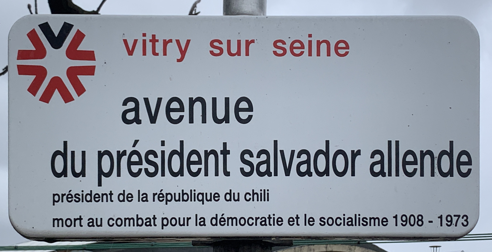

> Vitry sur Seine
>
> President Salvador Allende Avenue
>
> President of the Republic of Chile
>
> Died in combat for democracy and socialism 1908 - 1973

_[[ID 740](http://www.abacq.org/calle/index.php?2007/12/11/131-saint-ouen-l-aumone-francia)] Rue Salvador Allende at Saint-Ouen-l'Aumône, France ([Photo](https://commons.wikimedia.org/wiki/File:Saint-Ouen-l%E2%80%99Aum%C3%B4ne_(95)_Rue_Salvador_Allende_426.jpg) by GFreihalter, CC BY-SA 4.0)_

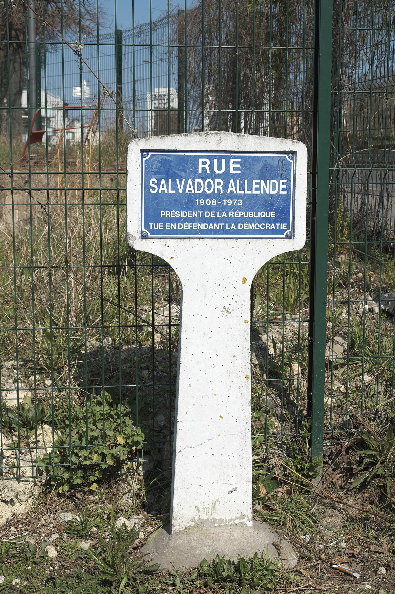

> Salvador Allende Street
>
> 1908-1973
>
> President of the Republic
>
> Killed while defending democracy

_[[ID 699](http://www.abacq.org/calle/index.php?2009/09/13/398-le-blanc-mesnil-francia)] Place Salvador Allende at Le Blanc-Mesnil, France ([Photo](https://commons.wikimedia.org/wiki/File:Plaque_Place_Salvador_Allende_-_Le_Blanc-Mesnil_(FR93)_-_2022-08-21_-_1.jpg) by Chabe01, CC BY-SA 4.0)_

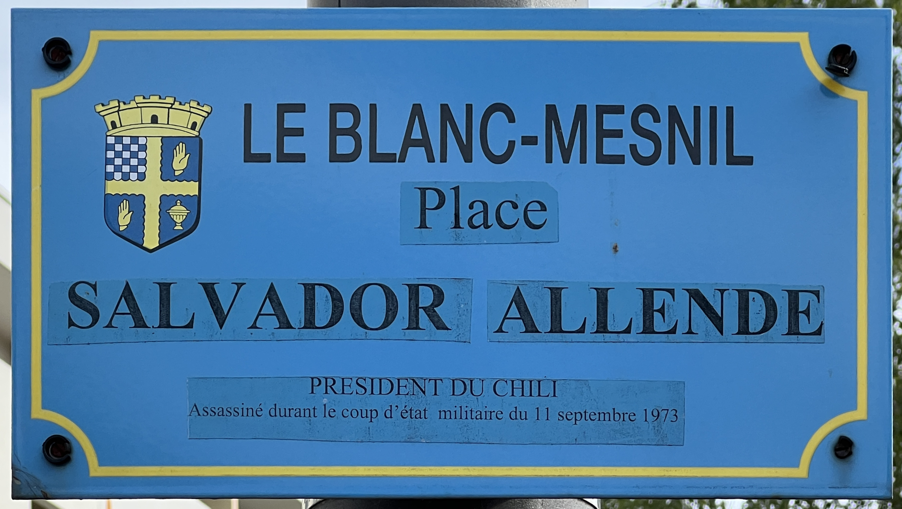

> Le Blanc-Mesnil
>
> Salvador Allende Square
>
> President of Chile
>
> Assassinated during the military coup d'état on 11 September 1973

_[[ID 711](http://www.abacq.org/calle/index.php?2009/03/05/332-montreuil-francia)] Avenue du Président Salvador Allende at Montreuil, France ([Photo](https://commons.wikimedia.org/wiki/File:Plaque_Avenue_Pr%C3%A9sident_Salvador_Allende_-_Montreuil_(FR93)_-_2020-10-23_-_2.jpg) by Chabe01, CC BY-SA 4.0)_

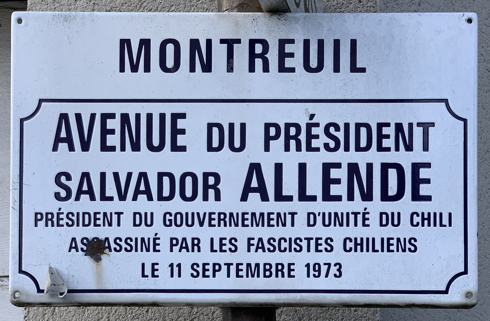

> Montreuil
>
> President Salvador Allende Avenue
>
> President of the Unity Government of Chile
>
> Assassinated by the Chilean fascists on 11 September 1973

#### **Catalonia**

_[[ID 335](http://www.abacq.org/calle/index.php?2010/09/03/500-rubi-espana)] Plaça de Salvador Allende at Rubí_

In this park at Rubí named after Salvador Allende, there is a [dedication stone](https://monuments.iec.cat/fitxa.asp?id=366) made of marble that reads:

> This park symbolizes the effort of ex-president Salvador Allende to preserve the rights and freedoms of the Chilean people
>
> Rubí, 14 November 1999

_[[ID 312](http://www.abacq.org/calle/index.php?2011/09/09/538-valls-espana)] Monument to Salvador Allende at Plaça de l'Estació in Valls ([Photo](https://commons.wikimedia.org/wiki/File:015_Monument_a_Salvador_Allende,_pl._de_l%27Estaci%C3%B3_(Valls).jpg) by Enric, CC BY-SA 4.0)_

> The City of Valls
>
> to Salvador Allende
>
> President of Chile 1970-1973
>
> Valls, 16 September 2010

_[[ID 339](http://www.abacq.org/calle/index.php?2009/10/25/425-barcelona-espana)] Plaça de Salvador Allende at Barcelona_

_[[ID 359](http://www.abacq.org/calle/index.php?2007/07/09/82-barcelona-espana)] "A Salvador Allende" ("To Salvador Allende") by Lautaro Díaz at Barcelona ([Photo](https://commons.wikimedia.org/wiki/File:Altre_11_de_setembre.jpg) by Xaxat, CC BY-SA 3.0 Spain)_

![Photo of the bust "A Salvador Allende" by Lautaro Díaz located within Salvador Allende Park at Barcelona. The bust, composed of Allende's head and neck, is installed jutting off from a bronze plaque with an inscription above the bust (translation of the inscription follows). On the side of the bust, to the viewer's left, there is the Chilean flag and an outline of South America with Chile's borders emphasized. The whole bronze plaque containing these features is placed over a bigger vertical steel sheet so that the plaque could be mounted on the park's wall. Spanning across the vertical steel sheet, below the bronze plaque, and mounted on the wall is a large horizontal dedication plaque that says "A Salvador Allende" ("To Salvador Allende"). Carme Grandas writes in the online catalog of public art in Barcelona: "The head is sculpted in strong, bold, even brutal strokes, appropriate for the person it depicts, his manner of death, and for the work itself."](assets/359_Spain_Barcelona_A-Salvador-Allende.jpg)

> **TO SALVADOR ALLENDE**
>
> "History is ours and is made by the people"
>
> SALVADOR ALLENDE GOSSENS 1908-1973
>
> Chilean politician. Founder of the Chilean Socialist Party, Minister of Public Health, Member of Parliament and Senator.
>
> Having been elected President de the Republic in 1970, his government initiated the path towards socialism along democratic lines, carrying out important reform projects and nationalizations.
>
> On 11 September 1973 the Government of "Unidad Popular" [Popular Unity], presided over by Allende, was overthrown by a coup. Salvador Allende died heroically during the assault on the Palacio de la Moneda.
>
> [_Note: English translation and alt text are taken from the [bust's page](https://w10.bcn.es/APPS/gmocataleg_monum/FitxaMonumentAc.do?idioma=EN&codiMonumIntern=960) in the online catalog of public art in Barcelona. Write-ups by Jaume Fabre, Josep M. Huertas; review by Carme Grandas._]

The Salvador Allende Park at Barcelona was inaugurated in April 1985 and its primary feature used to be a fountain. Upon the initiative of Chilean residents in Barcelona, and to make the dedication to Allende more obvious, Chilean artist Lautaro Díaz created a bust of Allende made of bronze. The bust was installed in this park and was inaugurated on 11 September 1997 (24th anniversary of the coup) in the presence of Isabel Allende Bussi, one of Salvador Allende's children, as well as Chilean and Catalan representatives.

What binds Chilean and Catalan people together in solidarity is the date 11 September. For Chileans, this date is a symbol of Allende's democratic efforts towards economic independence despite external resistance; for Catalans, this date is a symbol of their democratic efforts towards [national independence](https://en.wikipedia.org/wiki/Catalan_independence_movement) despite external resistance.

While 11 September or 9/11 is best known worldwide as the anniversary of the 2001 terror attacks in the US, this in itself is an example of _world_ history being defined exclusively by _US_ events from a _US_ perspective  to benefit _US_ interests exclusively.

The 1973 coup d'état in Chile happened way earlier than these terror attacks, is influenced by global political contexts, is symbolic of external disruptions to internal processes that have become a common theme across peoples (including Catalan people), and has long-lasting consequences and impact. Fifty years later, this event is still lesser known worldwide compared to the terror attacks in the US.

What is even lesser known is that 11 September also marks the national day of Catalonia, called locally as the "[Diada](https://en.wikipedia.org/wiki/National_Day_of_Catalonia)" (literally "Day"). On this day in 1714, after a year-long battle in Barcelona, the Catalan army lost to the army of King Philip V, and the Catalan institutional system and rights were replaced with Philip V's absolute rule in an attempt to unify Spain. Modern-day celebrations of the Diada involve offering flowers and respects to Catalan army members who fought in 1714, as well as rallies in favor of Catalonia's independence from Spain despite persistent resistance from Spanish authorities.

#### **Italy**

In a now-democratic country with a fascist dictator past, where the [original idea of fascism](https://en.wikipedia.org/wiki/Italian_fascism) was born, was influenced by Nazi Germany, and evolved into a state that legalized racism and disregarded individual freedoms for the sake of imperialist nationalism, it is not surprising to see memorials to Allende.

_[[ID 227](http://www.abacq.org/calle/index.php?2011/02/22/513-jesi-italia)] Largo Salvador Allende at Jesi, Italy_

There is a lane in Jesi named after Salvador Allende as well as a memorial stone erected on the 10th anniversary of the coup, though [Google Street View imagery](https://goo.gl/maps/nMLFVFk6e9GGEXce7) suggests that the memorial stone (if it still exists today) may not be located at this lane but rather somewhere else in Jesi.

> Santiago 11 September 1973
>
> "My sacrifice will not be in vain:
>
> Long live Chile,
>
> Long live the Chilean people"
>
> President Salvador Allende, martyr of socialism and democracy
>
> City of Jesi
>
> 11 September 1983

_[[ID 243](http://www.abacq.org/calle/index.php?2007/02/18/26-italia)] Piazza Salvador Allende at Arenzano, Italy_

The place name sign isn't immediately apparent from the [Google Street View imagery](https://goo.gl/maps/cpr44t88iWfcRxSz5)—viewers have to move and/or turn through the parking area towards the area with bushes, trees and other greenery. To the right, there stands an aging place name sign with a green pole that looks like a [dental floss handle](https://i.pinimg.com/originals/61/14/c2/6114c2ab4270b50db318ea333891fd79.jpg). Upon zooming in, the sign reads:

> Salvator Allende
>
> Antifascist martyr
>
> [_Note: the typo is included in the sign itself._]

_[[ID 267](http://www.abacq.org/calle/index.php?2008/09/10/262-orgosolo-italia)] Via Allende and mural dedicated to Salvador Allende at Orgosolo, Italy_

This mountain town is known for colorful murals all around its buildings; most of these murals are political and feature lesser known personalities and events around the world. It has a street named after Allende (Via Allende) and as expected there is also a mural dedicated to Allende near the intersection of Corso Repubblica and Via Cavour.

> 11 September 1973. Chilean military fascists, supported by the [United States] CIA, carry out a coup d'état and bomb the presidential palace where President Salvador Allende is found.

The mural also quotes an excerpt—in its original Spanish language—from Allende's [last speech](https://www.marxists.org/archive/allende/1973/september/11.htm) delivered via radio from the La Moneda presidential palace at 9:10 am in the middle of the coup:

> Sigan ustedes sabiendo que, mucho más temprano que tarde, se abrirán las grandes alamedas por donde pase el hombre libre para construir una sociedad mejor.
>
> [Go forward knowing that, much sooner rather than later, the great avenues will open again where free people will walk through to construct a better society.]

#### **Argentina, Austria and Belgium**

Allende's pursuit of social justice through democratic means finds sympathy around the world, because respect for democracy and social justice is not exclusive to socialism. Rather, both should be expected from any government, local or national, regardless of political affiliation or lack thereof.

_[[ID 113](http://www.abacq.org/calle/index.php?2011/09/15/547-buenos-aires-argentina)] Memorial plate to Salvador Allende at Plaza República de Chile, Buenos Aires, Argentina ([Photo](https://commons.wikimedia.org/wiki/File:Salvador_Allende_en_Plaza_Chile.JPG) by Gelpgim22 (Sergio Panei Pitrau), CC BY 3.0)_

This aptly named park in central Buenos Aires—Republic of Chile Park—is located next to the Chilean embassy in Buenos Aires and has monuments and memorial plates to several Chilean historical personalities.

> Hommage of the legislature of the City of Buenos Aires in the birth centennial of the President of the Republic of Chile
>
> Salvador Allende Grossens
>
> Fighter for liberty, democracy and social justice
>
> 1908 - 26 June - 2008
>
> [_Note: the typo is included in the memorial plate itself._]

A photo from the park submitted to [Google Maps](https://goo.gl/maps/bC8B4zyaEvwK6u64A) by Ramon Luizaga on December 2021 reveals that there is another memorial plate to Allende inaugurated by the legislature of the City of Buenos Aires during the 25th anniversary of the coup in 1998.

_[[ID 116](http://www.abacq.org/calle/index.php?2009/10/08/421-viena-austria)] Salvador-Allende-Denkmal at Donaupark, Vienna, Austria ([Photo 1](https://commons.wikimedia.org/wiki/File:20210620_Donaupark_Salvador-Allende-Denkmal_01.jpg) by Funke, CC BY-SA 4.0. [Photo 2](https://commons.wikimedia.org/wiki/File:Salvador_Allende_monument_plaque,_Donaupark_(Vienna).jpg) by Robot8A, CC BY-SA 4.0.)_

> "Sooner rather than later, the great avenues will open again where free people will walk through to construct a better society."
>
> Words from Allende's last speech, before he and thousands more died during the military coup on 11 September 1973. The coup was a reaction to his democratic fight for social justice.
>
> Salvador Allende G. 26 June 1908 - 11 September 1973

_[[ID 772](https://commons.wikimedia.org/wiki/Category:Monuments_and_memorials_to_Salvador_Allende)] Monument to Salvador Allende at Université Libre de Bruxelles, Brussels, Belgium ([Photo](https://commons.wikimedia.org/wiki/File:Buste_Salvator_Allende_ULB_Bruxelles.jpg) by Geertivp, CC BY-SA 4.0)_

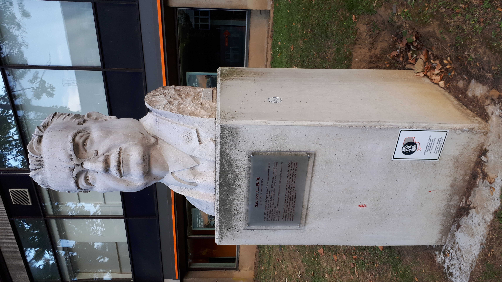

> Salvador ALLENDE
>
> (26 June 1908 - 11 September 1973)
>
> Elected President of the Republic of Chile in 1970 by many who have nothing. Overthrown in violence by a few who have everything.
>
> He preferred to pay with his life, on 11 September 1973, at the Presidential Palace of La Moneda, in Santiago de Chile, his will to give his people liberty, equality, fraternity.
>
> That day, he was able to broadcast to his people and to the world a final call:
>
> "Workers of my country, I have faith in Chile and its destiny. Other people will overcome this dark and bitter moment when treason seeks to prevail. Go forward knowing that, much sooner rather than later, the great avenues will open again where free people will walk through to construct a better society."

### Chilean community

Chileans are the most affected by Allende's efforts and the disruptions faced by his government.

When the Chilean state under Pinochet was not willing to do the necessary honors for Allende, these Chileans did, from their respective countries of residence. And even after democracy had been restored in Chile, they continue to do the honors wherever they are in the world.

To achieve this, they come together as a community and collaborate with local governments and society groups to make commemorative spaces for Allende.

#### **Chilean community in South America**

_[[ID 181](http://www.abacq.org/calle/index.php?2007/03/02/83-caracas-venezuela)] Monument to Salvador Allende at Plazuela Salvador Allende, Caracas, Venezuela_

> "Know that, sooner rather than later, the great avenues will open again where free people will walk through"
>
> Salvador Allende
>
> (Last message to Chilean people: 11-09-73)
>
> Chilean Democratic Community
>
> Sculptor: Ana Avalos
>
> 11-09-93

_[[ID 184](http://www.abacq.org/calle/index.php?2007/10/11/117-valencia-venezuela)] Avenida Salvador Allende and monument to Salvador Allende at Valencia, Venezuela_

Salvador Allende Avenue at Valencia, capital of the Carabobo state in Venezuela, is located within the University of Carabobo. On one of the university's entrances, there is a bust of Allende created by Rubén Colombo. Below the plate quoting Allende's last speech, there are some other plates that mention interest groups including the Socialist Party of Chile in Carabobo.

> Social processes can be arrested by neither crime nor force.
>
> History is ours, and people make history.
>
> Salvador Allende
>
> 26-06-1908 - 11-09-1973

#### **Chilean community in North America**

_[[ID 85](http://www.abacq.org/calle/index.php?2010/10/20/502-ottawa-canada)] Memorial tree and plate to Salvador Allende at Ottawa, Canada_

> President of Chile
>
> Salvador Allende Gossens
>
> 1908 - 1973
>
> At his centennial
>
> Chilean Popular Unity Ottawa - Gatineau
>
> Montréal, Toronto
>
> June 26, 2008

_[[ID 145](https://commons.wikimedia.org/wiki/Category:L%27arc)] The sculpture "L'Arc" by Michel de Broin, at Montréal, Canada ([Photos 1](https://commons.wikimedia.org/wiki/File:L-arc_-_Michel_de_Broin_02.JPG) and [2](https://commons.wikimedia.org/wiki/File:L-arc_-_Michel_de_Broin_13.JPG) by Jeangagnon, CC BY-SA 3.0)_

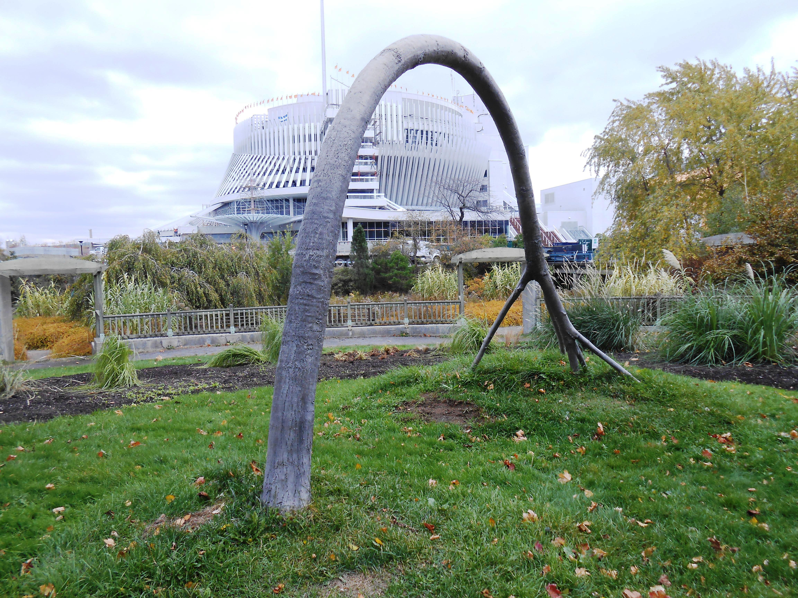

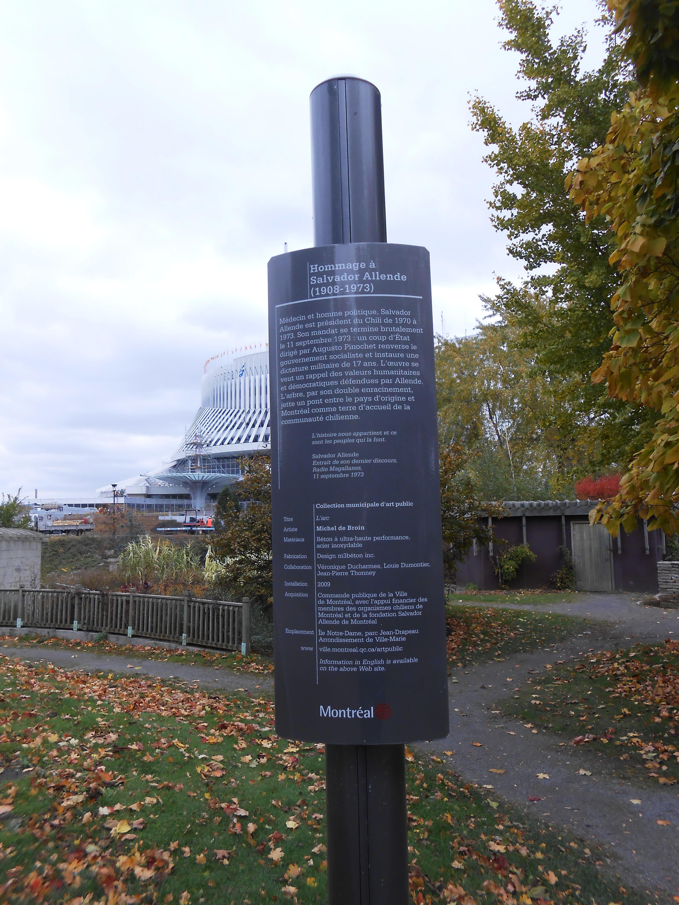

This sculpture by Michel de Broin was commissioned in time for Allende's centennial and was completed in 2009.

> **Tribute to Salvador Allende (1908-1973)**
>
> A physician and politician, Salvador Allende was president of Chile from 1970 to 1973. His mandate ended suddenly on 11 September 1973: a coup d’état led by Augusto Pinochet deposed his socialist government and installed a military dictatorship that lasted 17 years. The artwork is a reminder of the humanitarian and democratic values promoted by Allende. The tree, by its double roots, builds a bridge between the country of origin and Montréal as a land of welcome for the Chilean community.
>
> "History is ours, and people make history."
>
> Salvador Allende
>
> Excerpt from his final speech,
>
> Radio Magallanes, 11 September 1973
>
> _Municipal collection of public art_
>
> Title: ***L’arc***
>
> Artist: **Michel de Broin**
>
> Materials: Ultra-high performance concrete, stainless steel
>
> Fabrication: Design m3béton inc.
>
> Collaboration: Véronique Ducharmes, Louis Dumontier, Jean-Pierre Thonney
>
> Installation: 2009
>
> Acquisition: Public commission from the Ville de Montréal, with financial support from members of Chilean organizations in Montréal and the Salvador Allende Foundation in Montréal
>
> Location: Île Notre-Dame, parc Jean-Drapeau, Arrondissement de Ville-Marie
>
> [_Note: English translation and alt text are taken from the [sculpture's page](https://artpublic.ville.montreal.qc.ca/en/oeuvre/larc/) in the Ville de Montréal's website._]

#### **Chilean community in Europe**

_[[ID 85](http://www.abacq.org/calle/index.php?2010/01/15/412-copenhague-dinamarca)] Mural and monument to Salvador Allende at Copenhagen, Denmark_

This mural painted in bright red, inaugurated on 4 November 2003, bears a black outline of Allende's likeness while delivering a speech. It contains a small memorial plate that provides context:

> **Hommage in memory of Salvador Allende**
>
> "Sooner rather than later, the great avenues will open again where free people will walk through to construct a better society"
>
> President of Chile
>
> 1970–1973
>
> On behalf of Chileans residing in Denmark
>
> with support from SID
>
> Salvador Allende Group
>
> Denmark–Chile

_[[ID 118](https://www.openstreetmap.org/way/758217539)] Salvador-Allende-Weg at Donaupark, Vienna, Austria ([Photo](https://commons.wikimedia.org/wiki/File:Donaupark_12_M%C3%A4rz_2021_11_12_56_999000.jpeg) by Robot8A, CC BY-SA 4.0)_

This path is located within the Donaupark (Danube Park) and leads to the memorial bust to Salvador Allende [shown earlier](https://github.com/GoGroGlo/a-place-for-salvador-allende/blob/main/a_place_for_salvador_allende.md#argentina-austria-and-belgium).

> The "Salvador-Allende-Weg" [Salvador Allende Way] was named after Salvador Allende, born in 1908 in Valparaíso, president of Chile, physician and co-founder of the Socialist Party of Chile. Allende died on 11 September 1973 in Santiago de Chile during the takeover of the presidential palace by the coup plotters. This path on the Danube Park was built with support from Chilean workers (refugees).

#### **Chilean community in Australia**

_[[ID 114](http://www.abacq.org/calle/index.php?2011/08/25/534-fairfield-australia)] Monument to Salvador Allende at Fairfield, Australia_

> **Dr. Salvador Allende Gossens**
>
> 26th June 1908 - 11th September 1973
>
> President of Chile 1970 - 1973
>
> Last Broadcasting Words;
>
> _Workers of my homeland!_
>
> _I have faith in Chile and its destiny._
>
> _Other men will overcome this gray and bitter moment where treason tries to impose itself._
>
> _May you continue to know that much sooner than later the great avenues through which free men walk to build a better society will open._
>
> _Long live Chile!_
>
> _Long live the people!_
>
> _Long live the workers!_
>
> This monument was unveiled on the 28th of Septiembre 2003.
>
> We thanks all those that assisted with this project including the
>
> Construction Forestry Mining Energy Union
>
> Salvador Allende Committee of Adelaide
>
> Salvador Allende Solidarity Group of Canberra
>
> Committee Pro Monument Salvador Allende of Sydney
>
> In Chile September 11, 1973 President Salvador Allende was overthrown in a bloody military coup led by General Pinochet.
>
> During the dictatorship thousands of supporters of the elected President were killed, disappeared, tortured and imprisoned.
>
> 29th May 2005

#### **Chileans in Chile**

The examples so far make it look like Allende is only commemorated outside of Chile—this was true during the dictatorship. Chileans inside Chile had to wait for the end of the dictatorship to be able to dedicate public spaces to Allende.

_[[ID 102](https://es.wikipedia.org/wiki/Museo_de_la_Solidaridad_Salvador_Allende)] Museo de la Solidaridad Salvador Allende at Barrio República, Santiago, Chile_

This contemporary art museum seems to not have been mentioned in any post in _Una calle Salvador Allende_, but deserves to be mentioned because it lived alongside Allende himself and is a perfect example of exile and coming back home experienced in Chilean history.

A Spanish art critic proposed a project to establish a museum in support of Allende's government. Allende approved this proposal, then wrote an open letter to artists around the world calling for artistic donations in all forms.

_([Photo](https://commons.wikimedia.org/wiki/File:Wiki_MSSA_-_Ingreso_MSSA.JPG) by Warko, CC BY-SA 3.0_)

> "On behalf of the people and the government of Chile, I extend my emotional gratitude to the artists who have donated their works to build the foundation of the future Museum of Solidarity. It is undoubtedly an exceptional event, which inaugurates an unprecedented type of relationship between creators and the public."
>
> Letter from Salvador Allende to the artists of the world, Santiago, 1972

He officially inaugurated the museum on 17 May 1972—at that time, it was named "Museo de la Solidaridad" ("Museum of Solidarity").

After the 1973 coup and the installation of the dictatorship, the museum closed and its art, artists and managers went into exile outside Chile. A group of artists organized a roving museum from their places of exile, continued accepting art donations, and organized exhibitions all around Europe to denounce human rights violations during the dictatorship.

The museum was officially reestablished on September 1991, a year after the end of dictatorship in Chile, under its current name. It has since recovered its art collection from the 1970s, received new art donations, and currently houses some of Allende's personal objects, some of which are shown below:

* Doctor's cape.
* Presidential sash and a copy of Allende's 1939 work _La realidad médico social chilena_ (_The Chilean medico-social reality_).
* Socialist Party membership card, watch, wallet, and an unidentifiable long brown object bearing his initials S.A.G.

_([Photos 1](https://commons.wikimedia.org/wiki/File:Objetos_personales_de_Salvador_Allende_en_el_Museo_de_la_Solidaridad_-_1.jpg), [2](https://commons.wikimedia.org/wiki/File:Objetos_personales_de_Salvador_Allende_en_el_Museo_de_la_Solidaridad_-_2.jpg) and [3](https://commons.wikimedia.org/wiki/File:Objetos_personales_de_Salvador_Allende_en_el_Museo_de_la_Solidaridad_-_3.jpg) by ProtoplasmaKid, CC BY-SA 4.0_)

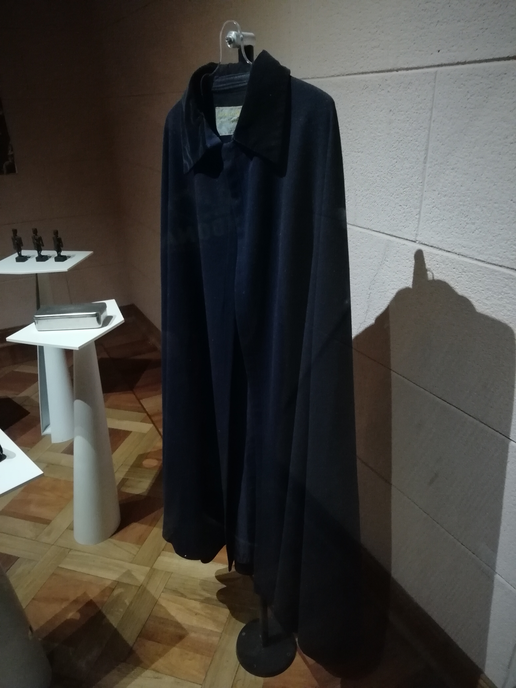

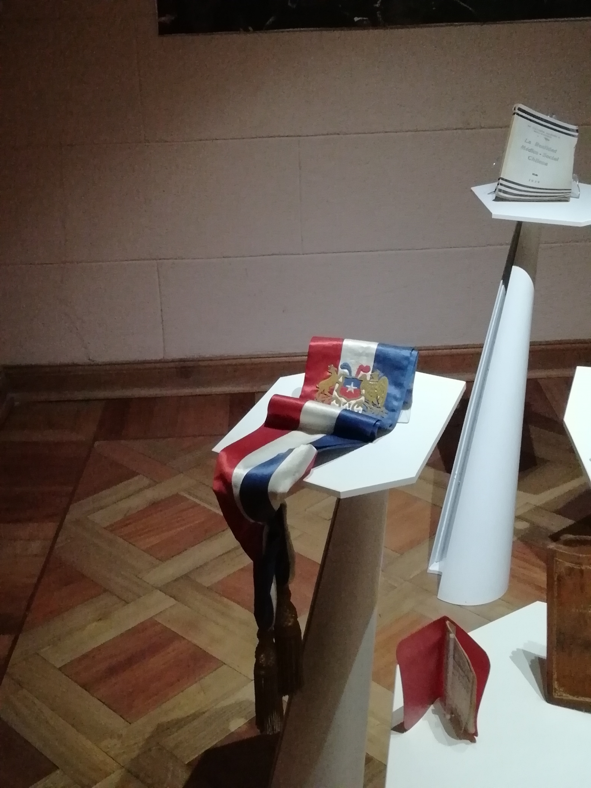

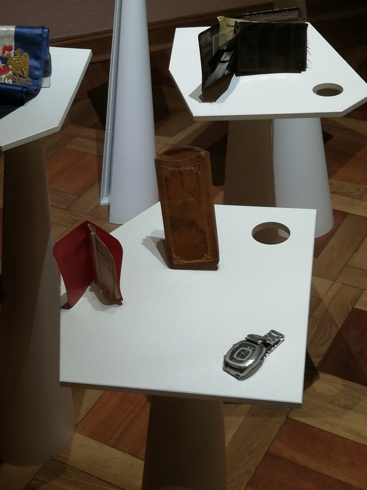

_[[ID 21](http://www.abacq.org/calle/index.php?2008/10/22/276-valparaiso-chile)] Plaza del Pueblo Salvador Allende at Valparaíso, Chile_

This park in the place of origin of Allende's family (and sometimes mentioned as Allende's birthplace, though his [birth certificate](https://commons.wikimedia.org/wiki/File:CLSRCeI_AP1190806260(1)_(page_1_crop).jpg) suggests that he was born in Santiago) is another example of a public space that lived alongside the President. The memorial plate takes advantage of Allende's iconic thick and rounded glasses to identify the park—this memorial plate can be seen in the park's photos in [Google Maps](https://goo.gl/maps/DJandbNBEfehjLsG8).

> **Salvador Allende People's Park**
>
> Work constructed during the Popular Unity government headed by President Salvador Allende Gossens (1970 - 1973)
>
> Inaugurated on June 2008 under the administration of Mayor Aldo Cornejo González and the Municipal Council 2004 - 2008
>
> Recuperated under the administration of Mayor Jorge Sharp Fajardo in 2017.
>
> "Being young and not being revolutionary is a contradiction at a biological level."
>
> Coordinating Roundtable for Human Rights
>
> Valparaíso Mayor's Office

_[[ID 18](http://www.abacq.org/calle/index.php?2008/11/16/285-santiago-chile)] Monument to Salvador Allende in front of La Moneda Palace, Santiago, Chile ([Photo](https://commons.wikimedia.org/wiki/File:Monumento_Salvador_Allende_Gossens.jpg) by Rjcastillo, CC BY-SA 4.0)_

The Congress of Chile approved a law in 1994 which said that three monuments in honor of Allende shall be built in Punta Arenas, Valparaíso, and Santiago. This [monument in Santiago](https://es.wikipedia.org/wiki/Monumento_a_Salvador_Allende_(Santiago_de_Chile)) by Arturo Hevia was inaugurated on 26 June 2000 and stands just outside of the La Moneda Palace, where Allende died in 1973, as well as the Ministry of Justice and Human Rights of Chile. Due to its symbolic location, this monument serves as a [focal point](https://commons.wikimedia.org/wiki/Category:Monumento_a_Salvador_Allende,_Santiago_de_Chile) where supporters do floral offerings and demonstrations to commemorate Allende's death and protest against human rights violations.

> Salvador Allende Gossens
>
> (1908-1973)
>
> "I have faith in Chile and its destiny."
>
> 11 September 1973

Another focal point of commemorations is [Morandé 80](https://en.wikipedia.org/wiki/Morand%C3%A9_80), the address of one of La Moneda's doors which is only a few steps away from the monument to Allende.

_([Photo](https://commons.wikimedia.org/wiki/File:Morande_80_11_septiembre_2009.jpg) by Richard Espinoza, CC BY-SA 3.0)_

When Presidents of Chile used to live in La Moneda, Morandé 80 was a convenient backdoor for the President to be able to enter and leave the palace without time-consuming formalities. Symbolically speaking, the President of Chile enters and leaves this door as a common citizen, like other common Chileans who enter and leave their doors of residence. After 1958, Presidents don't live in La Moneda anymore.

What used to be a mundane yet symbolic backdoor became a historically significant door with increased symbolism when Salvador Allende's dead body was taken out of Morandé 80 after the 1973 coup. Symbolically speaking, the President who wished to die as President was taken out of La Moneda as a common citizen.

During the reconstruction of La Moneda after the coup, the door of Morandé 80 and the room where Allende died were [sealed off into disappearance](https://es.wikipedia.org/wiki/Palacio_de_La_Moneda) to avoid them becoming symbols of Allende. The door and room were restored 30 and 35 years after the coup, respectively.

The restoration of the room where Allende died includes two paintings by Guillermo Muñoz Vera, one of which is shown below, and some original furniture from before the 1973 coup, including the sofa where Allende died.

_[[ID 38](http://www.abacq.org/calle/index.php?2009/01/08/303-chile)] Salón Blanco Presidente Allende inside La Moneda Palace, Santiago, Chile ([Photo 1](https://commons.wikimedia.org/wiki/File:Sal%C3%B3n_Blanco_%E2%80%9CPresidente_Allende%E2%80%9D.jpg) by Oscampor, CC BY-SA 3.0. [Photo 2](https://commons.wikimedia.org/wiki/File:Oficina_Salvador_Allende.jpg) by Osmar Valdebenito from Santiago, Chile, CC BY-SA 2.0.)_

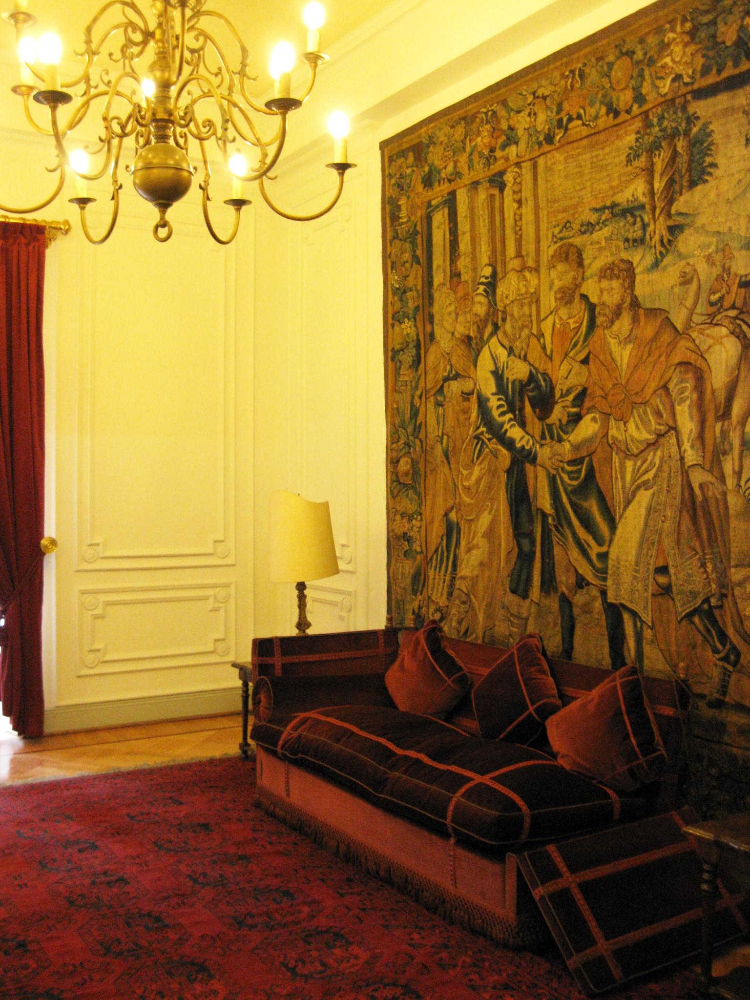

_[[ID 39](http://www.abacq.org/calle/index.php?2009/01/08/303-chile)] Memorial medal and plate to Salvador Allende inside La Moneda Palace, Santiago, Chile ([Photo](https://commons.wikimedia.org/wiki/File:Placa_conmemorativa_Salvador_Allende.jpg) by Osmar Valdebenito from Santiago, Chile, CC BY-SA 2.0)_

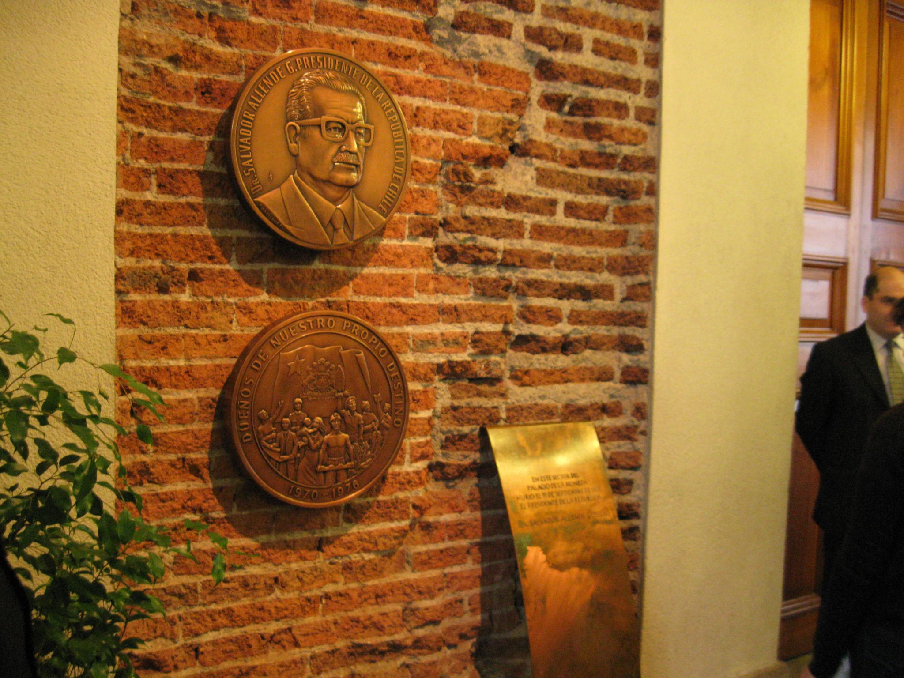

Aside from the restoration of the room where Allende died, there is a commemorative corner for Allende that was inaugurated in 2008 with the following features:

* A big commemorative medal dedicated to Allende and the nationalization of copper.
  * On one side, a portrait of Allende up to the shoulders, surrounded by text along the rim: "Dr. Salvador Allende G. President of the Republic of Chile".
  * On the other side, a depiction of a [Chilean presidential flag](https://upload.wikimedia.org/wikipedia/commons/thumb/8/8e/Bandera_del_presidente_de_Chile.svg/1500px-Bandera_del_presidente_de_Chile.svg.png) waving up high behind various Chilean citizens, including a parent and infant, a farmer, a soldier, an architect and a miner. The top text along the rim reads "Owners of our own destiny"; on the bottom it reads "1970 - 1976", the years which Allende would've served as president if he were to complete a six-year term.
* A piece of the original wall from after the bombing of the La Moneda Palace in 1973.
* A memorial plate that reads: "In this section of the La Moneda Palace, the President of the Republic Dr. Salvador Allende Gossens died on 11 September 1973".
* (Not seen in photo) On the opposite wall, a memorial plate listing the names of "staff of President Salvador Allende who gave their lives on 11 September 1973 in defense of the La Moneda Palace, democracy and liberty".

_[[ID 14](http://www.abacq.org/calle/index.php?2009/03/07/330-rancagua-chile)] Monument to Salvador Allende at Rancagua, O'Higgins Region, Chile ([Photo](https://commons.wikimedia.org/wiki/File:Monumento_Salvador_Allende_Gossens,_en_Alameda_Bernardo_O%22higgins_comuna_de_Rancagua.jpg) by Marco Antonio Correa Flores, CC BY-SA 4.0)_

The bust of Allende by sculptor Gregorio Berchenko is made of copper, the same resource that Allende nationalized to assert Chile's economic independence, much to the hostile reaction of the US government and businesses from whom the copper mines were taken.

The bust is framed within a white quadrilateral pillar that stands alongside two others. The pillar on the viewer's left has a large star drilled onto its upper half. The pillar on the right looks empty, but the article at _Una calle Salvador Allende_ says that it contains an excerpt from Allende's last speech. The star, the different textures across the three pillars, and the subtle line that divides the upper and lower parts of the pillars evoke the image of the flag of Chile. This monument was inaugurated on January 2009.

_[[ID 5](http://www.abacq.org/calle/index.php?2011/06/27/527-san-joaquin-chile)] Monument to Salvador Allende('s last speech) at San Joaquín, Santiago, Chile ([Photo](https://commons.wikimedia.org/wiki/File:Monumento_a_Salvador_Allende_en_San_Joaqu%C3%ADn.JPG) by Richard Espinoza, CC BY 3.0)_

One of the more recent memorials to Allende (relative to other memorials in the dataset with known dates of establishment) was unveiled on 26 June 2011.

This sculpture by Oscar Plandiura quotes the most from Allende's last speech—there are nine paragraphs of quotation inscribed on this high monument, excluding the title, location and date of the speech. Even from afar, it already looks like a long read despite not being the full speech.

Those who would like to read the full speech are advised to read this [English translation that comes with the original Spanish recording](https://www.marxists.org/archive/allende/1973/september/11.htm). (Be warned that the recording is suddenly very loud and startling at the end, but it is part of the violent background and emotional intent of Allende's last speech.)

## What does the data say about memorials to Salvador Allende around the world?

This project was able to gather from _Una calle Salvador Allende_, Wikimedia Commons, map websites and others a total of 780 memorial places around the world, but the project makes a distinction between extant and non-extant places. Here, a place is extant if its current name is (Salvador) Allende and if it is verified to exist in OpenStreetMap and/or Google Maps. There are 729 extant places and the following data visualizations focus on these extant places.

***Important note:*** this is a **non-exhaustive** list of memorial places to Salvador Allende because there could be a lot more that are not available in _Una calle Salvador Allende_ and Wikimedia Commons, both of which relied on user submissions. Finding more memorial places available in online maps (without violating their terms of use and risking an IP address ban) requires more time and effort, and even then not all of these places are recorded in online maps in the first place.

### Number of extant places by geographic region

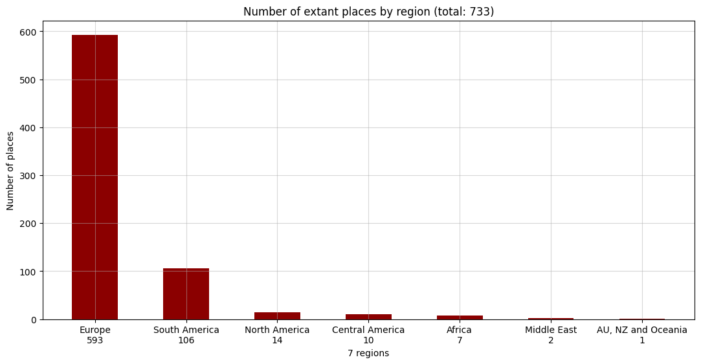

There are disproportionately more memorials to Allende in Europe than in any other geographical region, including South America itself where Chile is located: there are 592 memorials to Allende in Europe and 104 in South America. In the rest of the world, there are 13 in North America, 10 in Central America, 7 in Africa, 2 in the Middle East, and 1 in Australia.

There are two reasons for the geographic bias towards Europe, particularly France.

* First, most of the memorials to Allende are concentrated around Europe because a lot of national and local governments in Europe (socialist, democratic or both) sympathized with Allende and because a lot of Chileans exiled here. The combination of Chilean supporters and sympathizing governments made it easy for memorials to Allende to be built within Europe, when such memorials were practically impossible to build in Chile for a long time.

* Second, most submitters to _Una calle Salvador Allende_ submitted places within Europe. The maintainer of this website, Fernando Orellana, is a Chilean political refugee living in France (the website's [root URL](http://www.abacq.org/) showcases Orellana's photographic collections in French and Spanish). Since there are many Chilean refugees in Europe and freedom of movement across European countries is possible for European residents and citizens, it was easy for Chilean refugees in Europe to meet each other, find memorials to Allende, and even [expropriate](http://www.abacq.org/calle/index.php?2019/09/11/620-villejuif-francia) some place name signs to share between themselves and keep for future generations.

The initiative of Orellana and other users in France led to this project identifying 413 memorials to Allende in Metropolitan France (i.e., European France) and France's overseas departments of French Guiana in South America, Guadeloupe in Central America, and Réunion in the African part of Indian Ocean. If we exclude memorials in France, there are 186 in Europe, 103 in South America, 13 in North America, 8 in Central America, 3 in Africa, 2 in the Middle East, and 1 in Australia.

### Number of extant places by country

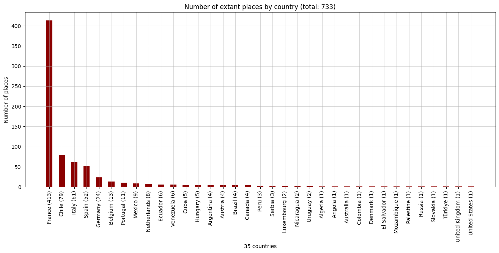

> Surely Radio Magallanes will be silenced, and the calm metal instrument of my voice will no longer reach you. It does not matter. You will continue hearing it. I will always be next to you.
>
> _—Excerpt from Salvador Allende's last speech, 11 September 1973_

Salvador Allende is present in at least 34 countries in the world including Chile.

Breaking down the number of memorials to Allende by country reveals a bleak yet expected reality that Salvador Allende, President of Chile, is more commemorated _outside_ Chile than _inside_ Chile.

If we exclude France's 413 memorials, Chile would have the most number of memorials in the world at 77. Here are the numbers in the rest of the world, in descending order.

* Italy: 61
* Spain: 52
* Germany: 24
* Belgium: 13
* Portugal: 11
* Mexico: 9
* Netherlands: 7
* Ecuador: 6
* Venezuela: 6
* Cuba: 5
* Hungary: 5
* Argentina: 4
* Austria: 4
* Brazil: 4
* Canada: 4
* Peru: 3
* Serbia: 3
* Luxembourg: 2
* Nicaragua: 2
* Uruguay: 2
* Algeria: 1
* Angola: 1
* Australia: 1
* Colombia: 1
* Denmark: 1
* El Salvador: 1
* Mozambique: 1
* Palestine: 1
* Russia: 1
* Slovakia: 1
* Turkey: 1
* United Kingdom: 1

However, the story quickly changes when all memorials outside Chile are combined—Chile's 77 memorials are vastly outnumbered by 652 memorials in the rest of the world.

If the 413 memorials in France are taken separately from the rest of the world, 239 memorials remain. This means that outside Chile, there are more memorials to Allende in France than in the rest of the world combined. [More than 300](http://www.abacq.org/calle/index.php?2009/05/13/349-salvador-allende-en-francia) of the memorials in France that are collected in this project were based on a list of pins in a [Google Maps user map](https://www.google.com/maps/d/u/0/viewer?hl=en&client=firefox-a&ie=UTF8&split=0&gl=fr&ei=FZYGSqbYC96TjAfY-J3xBA&oe=UTF8&msa=0&start=0&num=200&ll=47.620975%2C1.6918949999999988&spn=8.931111%2C17.226563&z=6&mid=1gGLfa09Bonh9I9D6gmdqNRLouRo) created by someone named Jean-Marie. The pins refer to streets alone and exclude other public places like parks, buildings and others, so this user map is not exhaustive (neither are all data in this project).

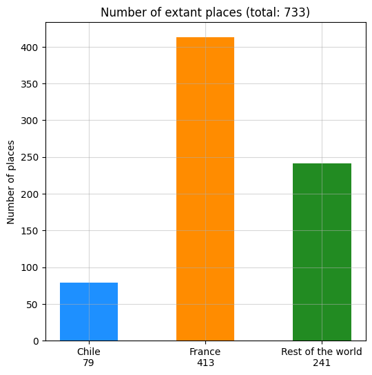

### Map of extant places in the world

### Number of extant places in Chile

In Allende's own country, there are at least 77 memorials scattered around 13 of the 16 regions of Chile. As expected, the most number of memorials can be found in the capital region, the Santiago Metropolitan Region.

* Santiago Metropolitan Region: 28
* Biobío: 7
* O'Higgins: 7
* Los Lagos: 6
* Antofagasta: 6
* Coquimbo: 5
* Valparaíso: 5
* Araucanía: 4
* Tarapacá: 3
* Magallanes: 2
* Maule: 2
* Los Ríos: 1
* Atacama: 1
* Arica y Parinacota: 0
* Aysén: 0
* Ñuble: 0

This list may seem like Allende is not well-represented outside the Metropolitan Region, but if all memorials outside of this region are combined, the 49 of them outnumbers the 28 in the Metropolitan Region.

The Metropolitan Region is composed of Santiago Province and other provinces just outside it. Santiago Province itself is composed of central Santiago (the location of the La Moneda Palace and what first comes to mind when people think of _the_ capital of Chile) and other communes. As expected, the Metropolitan Region is the most populous Chilean region.

_Una calle Salvador Allende_ lamentably notes that while a lot of capitals in the world have avenues and streets named after Salvador Allende, in central Santiago there is neither an avenue nor a street named after him. Instead, there is only a very short and obscure residential alley named Pasaje Allende (note the lack of "Salvador" as evidenced by the alley name signs) [[ID 4](http://www.abacq.org/calle/index.php?2012/12/04/596-santiago-chile)]. Someone suggested that those looking for an actual Salvador Allende street that is long enough to be called such are better off going to San Joaquín [[ID 41](https://goo.gl/maps/gBHuVxzs3kVYmQf18)], one of the communes of Santiago Province.

There aren't a lot of memorials to Allende in central Santiago—in fact, most if not all of them are already enumerated in this investigation. However, it is still interesting to note that of the 28 memorials to Allende in the Metropolitan Region, 22 are found in Santiago Province.

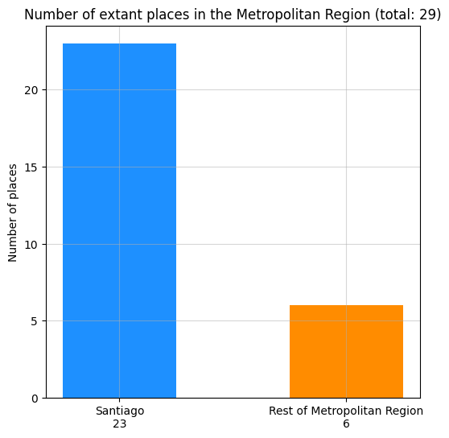

### Map of extant places in Chile

### Number of extant places by type

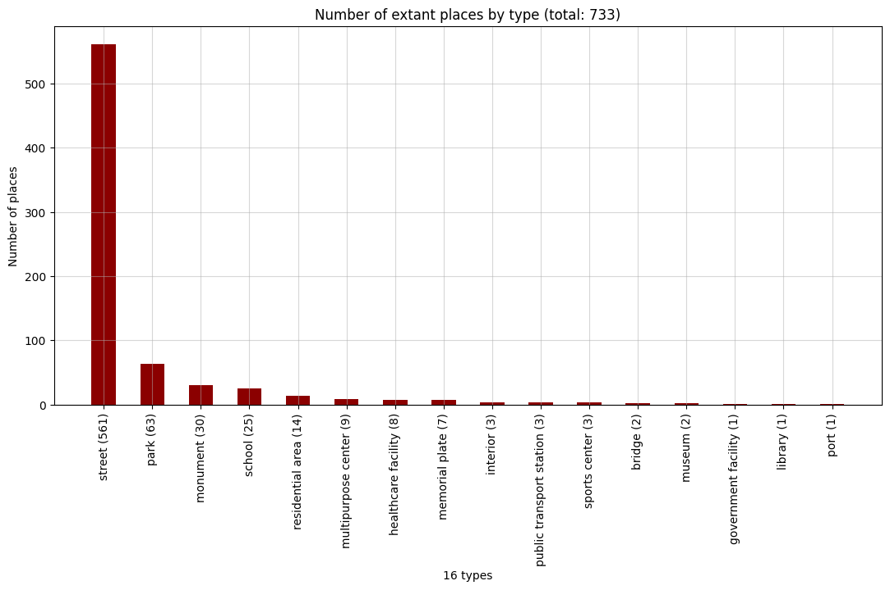

Perhaps the most quoted line from Allende's last speech, as evidenced by memorials above, is:

> Go forward knowing that, much sooner rather than later, the great avenues will open again where free people will walk through to construct a better society.

Indeed, of the 729 extant places in this investigation, 560 are streets or avenues. Other forms of memorials to Allende include:

* Parks: 63
* Monuments: 30
* Schools: 25
* Residential areas (e.g., neighborhood communities, towns): 14
* Multipurpose centers (e.g., cultural centers): 9
* Healthcare facilities (e.g., hospitals, clinics): 8
* Memorial plates: 5
* Public transport stations (e.g., bus stops): 3
* Sports centers: 3
* Bridges: 2
* Interiors (e.g., rooms, auditoriums): 2
* Museums: 2
* Government facility: 1
* Library: 1
* Sea port: 1

Even though Allende was a physican by profession who used to be health minister, there aren't a lot of healthcare facilities named after him. Fittingly enough, five of the eight healthcare facilities that this project was able to gather are located in Chile. One of these is the Hospital del Cobre Dr. Salvador Allende G. (Dr. Salvador Allende G. Copper Hospital) [[ID 23](http://www.abacq.org/calle/index.php?2009/02/06/311-calama-chile)], named as such because it used to serve as the hospital of the [Chuquicamata mine](https://en.wikipedia.org/wiki/Chuquicamata), one of the copper mines nationalized during Allende's government.

_[[ID 145](http://www.abacq.org/calle/index.php?2007/02/18/39-san-salvador-el-salvador)] Plaza Salvador Allende at the Faculty of Medicine of the University of El Salvador ([Photos 1](https://commons.wikimedia.org/wiki/File:Visita_a_Universidad_Nacional_de_El_Salvador_(20527780591).jpg) and [2](https://commons.wikimedia.org/wiki/File:Visita_a_Universidad_Nacional_de_El_Salvador_(20521427305).jpg) by Presidencia de El Salvador from San Salvador, El Salvador, América Central, CC0 Public Domain)_

Not all that commemorates Dr. Allende has to be a healthcare facility, though. For instance, there is a Salvador Allende Square in front of the Faculty of Medicine of the University of El Salvador. The square was first posted in _Una calle Salvador Allende_ in 2007, though it may have already existed earlier. The memorial plate in one of the artistic works unveiled by President Michelle Bachelet reads:

> Remodeling and artistic works of Salvador Allende Square
>
> Inaugurated at the Faculty of Medicine of the University of El Salvador
>
> In honor of the former Chilean president and his crusade for social medicine.
>
> Michelle Bachelet
>
> President of Chile
>
> San Salvador, 12 August 2015.

The poster on the right that is hanging on the building makes it more obvious that Dr. Allende is being commemorated as a doctor.

> Long live Salvador Allende!
>
> Doctor in service of the public
>
> Dean's Office, Faculty of Medicine

### Timeline of dates of establishment of places

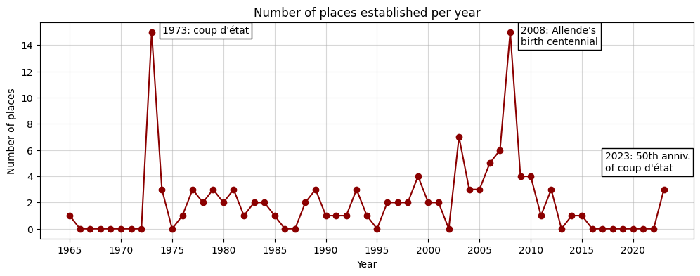

Not all extant places have known dates of establishment, or dates of renaming to Salvador Allende if they had been established before. Places with unknown dates of establishment or renaming were first posted on the internet either through OpenStreetMap, Google Maps or _Una calle Salvador Allende_, but most likely they had been existing even before the internet was invented.

This timeline considers only extant places around the world where the date of establishment or renaming is known—there are 118 of them in this dataset. The one place that was established in 1965 refers to Salvador-Allende-Hof in Vienna, Austria [[ID 115](http://www.abacq.org/calle/index.php?2011/10/23/557-viena-austria)]. This residential complex mentions that it was built between 1963 and 1965, when Allende was a senator at that time. It was probably renamed after him in 1973 or later, though this investigation cannot find sources to confirm this, hence the 1965 establishment year was kept.

There are two peak years in this timeline: the first is 1973 during the coup d'état and Allende's death, and the second is 2008 during Allende's 100th birth anniversary. For each year, there were 15 memorial places dedicated to Allende and perhaps many more that the dataset was not able to cover.

Almost every year between 1973 and 2008, there was a sustained interest in dedicating memorial places to Allende: between one to four memorials were being established from 1974 until 2001,  then the trend increased from 2003 to 2007 with between three to seven memorials every year. From 2008 to 2015, there were one to four memorials every year.

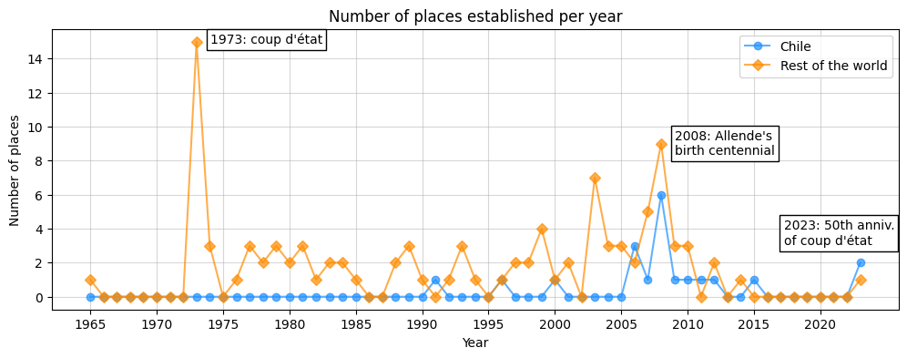

This timeline of memorial places in Chile vs. the rest of the world reveals where the interest was coming from.

As expected, all memorials to Allende from 1973 to 1990 come from outside Chile, including all 15 memorials established during 1973. From 1991 onwards, when democracy was restored in Chile, memorials to Allende were slowly being established in the country, though most memorials were still being established outside Chile.

Inside Chile, the peak number of memorials was reached during Allende's centennial in 2008—of the 15 centennial memorials in the dataset, 6 were established in Chile. From 2008 to 2015, new memorials to Allende were evenly distributed inside and outside Chile.

Most of the memorials to Allende in the dataset that are outside Chile come from France, so it makes sense to separate French memorials from the rest of the world in order to get a less skewed view of how memorials are geographically distributed across the years.

In this timeline of Chile vs. France vs. the rest of the world, the representation in France is surprisingly not as flattering as the total number of memorials to Allende in France. During 1973, France contributed 3 of the 15 memorials to Allende that are available in the dataset. In the following years, most of the memorials to Allende still came from outside France and Chile. Strangely enough, no memorials to Allende were established in France from 2008 onwards, at least according to the dataset.

This observation for France could be due to data availability issues where dates of establishment or renaming for French memorials could not be found in the sources used in this project. It could also be that some memorial places to Allende that were established earlier had been renamed (and worse, no longer recorded to have had Allende's name) due to several factors such as those mentioned in the [previous section on France](https://github.com/GoGroGlo/a-place-for-salvador-allende/blob/main/a_place_for_salvador_allende.md#france). The apparent lack of memorials to Allende in France that were established during 2008 could be because events to mark the centennial were being held in memorial places that had already been established before 2008.

### How did Salvador Allende die, really?

⚠ **Content warning: this whole section contains references to suicide and murder.**

Some memorials to Allende say that he was killed by the coup plotters, and at least one memorial disagrees with this version of events. Rather than elaborate on both death versions, this investigation seeks to explain at a psychological level why people would believe one death version over another.

Allende hinted in his speech during the coup that this was going to be his last, and that he would be willing to sacrifice himself, though the manner of sacrifice was vague.

> Given these facts, the only thing left for me is to say to workers: I am not going to resign! Placed in a historic transition, I will pay for loyalty to the people with my life. [...]
>
> Long live Chile! Long live the people! Long live the workers! These are my last words, and I am certain that my sacrifice will not be in vain [...]

There could be several reasons a lot of individuals found it easier to believe that Allende was killed.

* The first people who announced that Allende had killed himself were the coup plotters. Why would Allende's supporters believe what their enemies were saying?
  * An actual exchange between Pinochet and Vice Admiral Patricio Carvajal during the coup - 05:19 onwards in this [video from Memoria Chilena](http://www.memoriachilena.gob.cl/archivos2/videos/MC0043416.mpg):
    * > Carvajal: [_in Spanish_] There is a communication from the infantry school staff who is already inside La Moneda, and due to the possibility of interception I will transmit it in English: [_word-for-word_] They say that Allende committed suicide and is dead now. [_in Spanish_] Tell me if you understood.
    * > Pinochet: [_in Spanish_] Understood, perfectly understood.
* Suicide can be interpreted as an acceptance of defeat and is highly contradictory to Allende's announcement in his last speech that he would not resign. Supporters would rather believe that Allende fought until the end.
* The exact method of Allende's suicide, at least according to the autopsy, can come off as ridiculous or made-up to some individuals.
  * Who else would shoot oneself with an AK-47 rifle? Which was held between the legs and under the chin? And which was a gift from none other than Fidel Castro of Cuba? This is too oddly specific. Allende being shot by enemies would be much easier to imagine, perhaps.
* Suicide is just taboo for some individuals, depending on their personal background.

Narrative evidence supporting suicide only came about after the return of democracy in Chile, and an autopsy ordered by a court investigation in 2011 sought to add further details onto this narrative. Until then, Allende's supporters and others could only speculate about how he died, and the most intuitive reason was death in the hands of the enemies.

Right now, does believing that Allende died in his own hands make someone anti-Allende and pro-coup? Not necessarily, according to [some witnesses to the death](https://en.wikipedia.org/wiki/Death_of_Salvador_Allende):

> The other witnesses kept silent until after the restoration of democracy in Chile, as they believed (according to their own statements) that to corroborate the version of a suicide would in some measure downgrade Allende's sacrifice and lend support to the military regime.

In fact, one of the main advocates of the suicide narrative is one of Allende's children, Isabel Allende Bussi, who [said the following](https://www.bbc.co.uk/news/world-latin-america-14210729) in connection to the 2011 court investigation which concluded that Allende died by suicide:

> The report conclusions are consistent with what we already believed. When faced with extreme circumstances, he made the decision of taking his own life, instead of being humiliated.

[She added](http://www.isabelallendebussi.cl/lo-que-ocurre-la-noche-del-11-no-tiene-nada-que-ver-con-el-legitimo-recuerdo-de-las-victimas/):

> [...] it does not diminish in any way, on the contrary, it exalts the figure of Salvador Allende. It is clear that he was taken to an extreme situation, that he arrived at La Moneda around seven in the morning, that he resisted until two in the afternoon, that he was not willing to accept any offer to take him out of the country and take up exile.

Based on these statements and some others, there could be several reasons a lot of individuals can be convinced by the suicide narrative, but these reasons assume that they have no moral or emotional reservations about the act:

* Suicide, if done willingly, is a form of sacrifice that is as effective and moving as being killed in action.
* In extreme circumstances such as during the coup, where the only possible outcome Allende was willing to face was death, death in one's own hands can be seen as more dignified than death in the hands of the enemies.
  * The act shows that Allende was not just a passive victim of the coup. Rather, he wanted to be in charge of his own fate and legacy, which is not incompatible with his final message during the coup.
* Even if Allende would have made it out of the coup alive, he may have wanted to avoid being captured by the military and suffering the same fate as other Chileans who were killed right after the coup.
  * Taking up exile might be a good way to avoid capture, but this can be seen as an act of passivity and of choosing one's own convenience over confronting the hostile motivations behind the coup.
* Allende's death by suicide can be seen as an act of protest against the coup and its hostile motivations and means. Killing the President of Chile would've been as violent as the coup could be.
  * Even if Allende and his supporters put up an armed resistance against the military during the coup, he would have wanted to avoid having to defend the presidency through violent means.
  * In fact, Allende was supposed to deliver a speech on 11 September 1973 to call for a plebiscite as a way to resolve the political crisis in Chile that motivated the military to carry out the coup, ironically on the same day.

Regardless of the exact manner, Allende's dramatic death evokes sympathy towards anyone who would come across such narrative. The question now lies on which version of the narrative memorial places to Allende would tell.

In the dataset, there are 56 memorial places that mention Allende's death. The most used narrative is assassination with 33 places explicitly mentioning it. Meanwhile, only one place in the dataset explicitly mentions suicide: [the bust in Berlin](https://github.com/GoGroGlo/a-place-for-salvador-allende/blob/main/a_place_for_salvador_allende.md#former-east-germany).

Twenty places mention neither suicide nor assassination and instead keep it generic by saying "died" or something similar. Two places in France get more specific by saying that Allende died with a "weapon on hand", but this could be interpreted both as a suicide (when Allende shot himself with the weapon) and an assassination (when Allende resisted the military with a weapon on hand and was killed while holding the weapon).

## Conclusion

[work in progress] 

> At this point, politically it doesn't really matter how Allende died (if historical%). What matters is that we have streets and squares named after him.
>
> _—Gabriel Boric, current president of Chile. [Tweet](https://twitter.com/GabrielBoric/status/75411227647545344) from 31 May 2011, but edited and taken out of context._

## Who am I anyway and why am I doing this?

Full disclosure: I am not from Chile, I am not of Chilean descent, and I do not have any material connections with Chile.

However, I became interested in Chile because I used to be a data analyst working with publicly traded companies in Latin America. I also have a degree related to social sciences, which informs my approach towards this data investigation.

_Story time:_ Back when I was in my first year at university, a Chilean professor visited and gave a lecture on Chilean and Southeast Asian relations. I tried to take notes, but my academic interest at that time was clearly not Chilean affairs, so my notes ended up half-baked and I wrote the most controversial statement of 2015:

> Stable democracy (had an authoritarian gov't from 1960s to 1973)

I then finished university and got a job as a data analyst where one of the markets that we were working on is... Chile, so this time I had to be involved in Chilean affairs. During that time, I learned enough Spanish to be able to read it with minimal machine translation.

Then The Pandemic came and instead of exploring the central business district around my workplace I had to stay at home. I had nothing much to do aside from reading random Wikipedia articles and getting myself into Wikipedia rabbit holes, which included articles on the history of Chile.

That's how I found out six years later that Chile, in fact, did _not_ have an authoritarian government from the 1960s to 1973. I got the years mixed up because there indeed was an authoritarian government after 1973, but before that the presidents were democratically elected. This included Salvador Allende, the last democratically elected president before 1973.

My social sciences-educated self genuinely appreciates all the efforts that the Chilean diaspora and their counterparts back home have made to keep Allende's memory alive despite active suppression from the authoritarian government and their allies. I've never seen a memorial effort as scattered yet cohesive as this one.

This project is my penance for perpetuating the sin of suggesting that Salvador Allende was authoritarian. Kidding aside, Chile's rough history from Allende onwards was something I didn't have notes of back in 2015 and which I had to find out myself several years later. I am not an expert on the matter; I am just someone who is interested in it and would like to contribute to the cause, to the best of my understanding and abilities.

⚠ **Content warning: the following two paragraphs contain references to suicide.**

I did say that I am not from Chile, I am not of Chilean descent, and I do not have any material connections with Chile. However, I still do have a personal connection towards Allende as a topic.

I got interested enough in the topic to be aware of the details of how Allende died, at least according to the 2011 autopsy. And then I spent a year (perhaps more) fighting my own suicidal thoughts. I eventually got therapy for them, and I decided that engaging further with someone who once [shared](https://www.nytimes.com/1973/09/12/archives/socialist-says-allendeonce-spoke-of-suicide.html)  his own suicidal thoughts two years before doing the act is enabling my own suicidal thoughts, so I dropped all my interest towards Allende and Chile at large for a while. If Allende was actually assassinated and no one disputed it, I wouldn't have needed to write this whole paragraph.

I planned to visit Chile this year during the 50th anniversary of the coup d'état so that I can participate in the commemorations, but I ended up deciding that the money for the trip is better spent on physically and professionally improving myself as a form of mental health recovery. I only started this project when I felt that I was mentally prepared to go back to this interest—and here I am collecting all these places named after Allende while adding to my professional skillset and making sense of my thoughts about these topics.

This project was completed in time for the 50th anniversary of the coup d'état and may be updated from time to time—I do hope that my next updates will be due to new memorial places to Allende.
